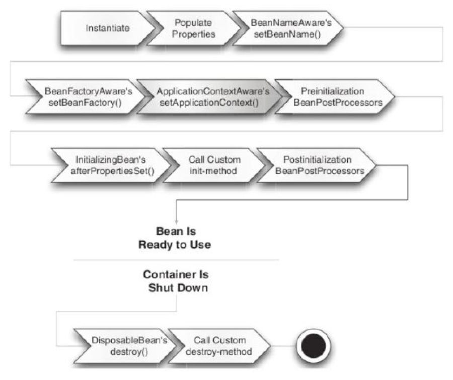
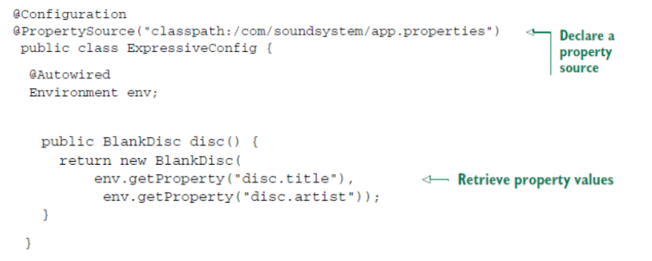
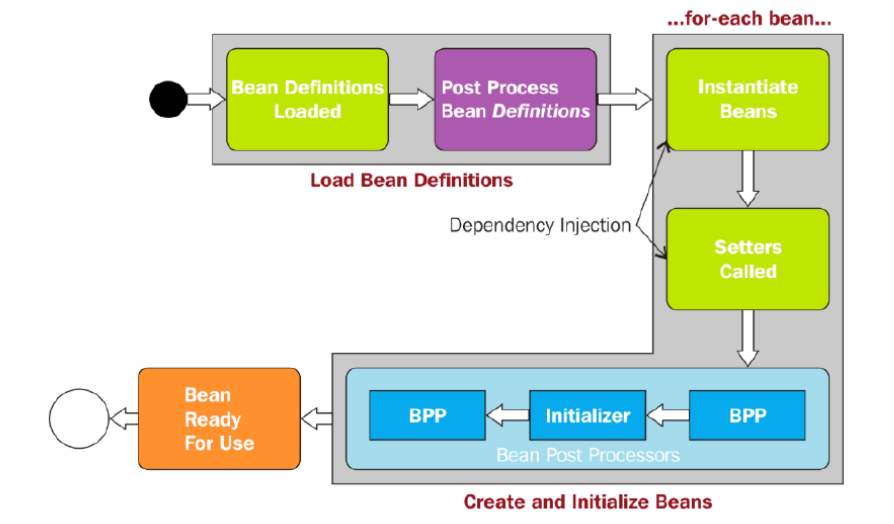
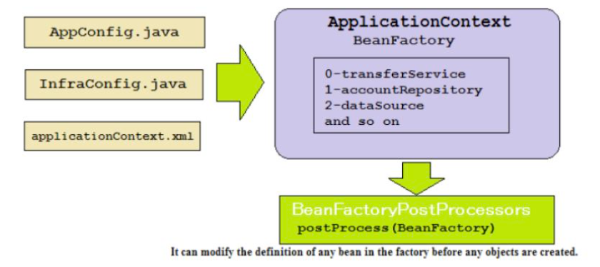
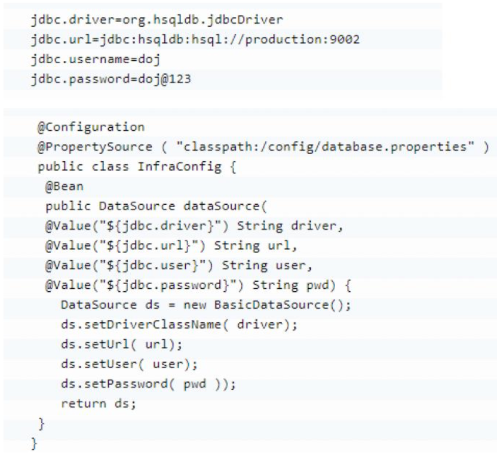
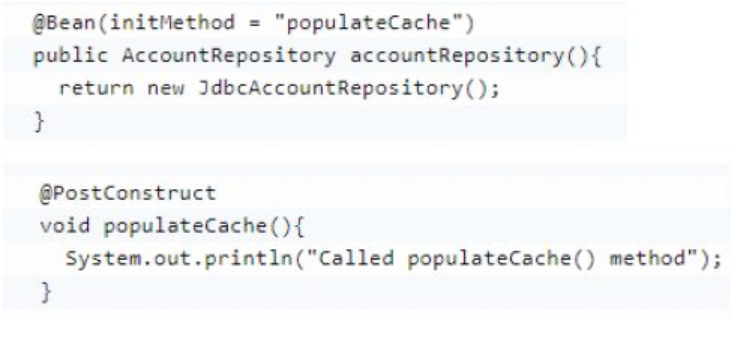
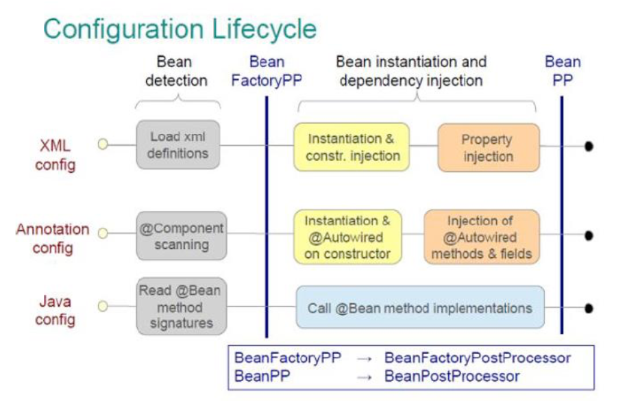
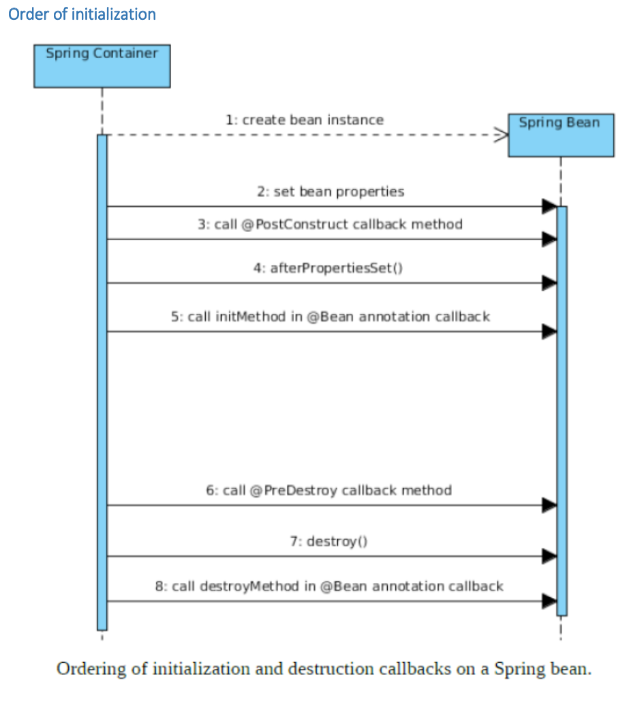
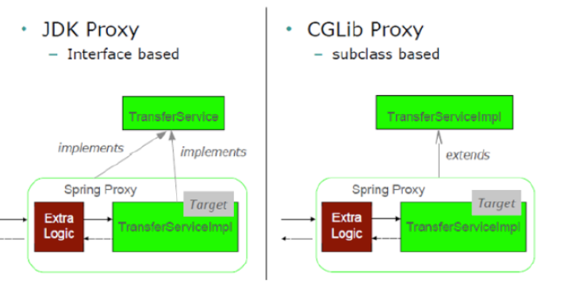
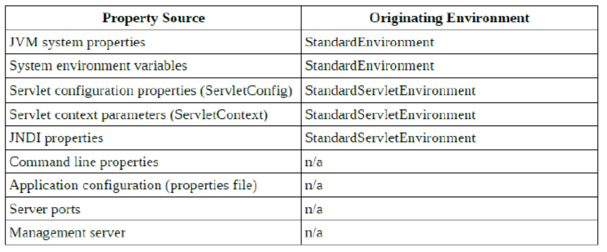

## What is dependency injection and what are the advantages?
Dependency injection is a design pattern that promotes loose coupling between the Spring components – that is, between the different collaborating POJOs. So by applying DI to your complex programming, your code will become simpler, easier to understand, and easier to test. 

According to the DI pattern, dependent objects are given their dependencies at the time of the creation of the objects by some factory or third party. This means that we have to focus on defining the dependencies instead of resolving the dependencies of collaborating objects in the enterprise application.

Advantages:

- Reduced coupling between the parts of an application.
- Increased cohesion of the parts of an application.
- Increased testability.
- Better design of applications when using dependency injection.
- Increased reusability.
- Increased maintainability.
- Standardizes parts of application development.
- Reduces boilerplate code.

## What is a pattern? What is an anti-pattern? Is dependency injection a pattern?

#### What is a pattern?

Software design pattern is a general, reusable solution to a commonly occurring problem within a given context in software design. It is a description or template for how to solve a problem that can be used in many different situations. Design patterns are formalized best practices that the programmer can use to solve common problems when designing an application or system.

#### What is an anti-pattern?

An anti-pattern is a commonly used template that attempts to solve a type of problem but turns out to be counterproductive and inefficient. An anti-pattern may also be a habit among software developers that reduces productivity or some desirable code quality etc.
Examples: premature optimization, analysis paralysis.

#### Is dependency injection a pattern?
Dependency injection (DI) and Inversion of Control (IoC) are both patterns.

## What is an interface and what are the advantages of making use of them in Java?

### A Java 8 and later interface is a reference type that can contain the following:
  
- Constants.
- Method signatures (these are methods that have no implementation).
- Default methods. A method with an implementation that, if not implemented in a class
that implements the interface, will be used as a default implementation of the method in question. This can be useful when adding new method(s) to an interface and not wanting to modify all the classes that implement the interface.
- Static methods (static methods with implementation).
- Nested types (such a nested type can be an enumeration). 

### Advantages of Interfaces:
- Allows for decoupling of a contract and its implementation(s).
- Allows for modularization of Java programs.
- Allowing for handling of groups of object in a similar fashion. For example, all objects
of classes implementing the java.util.List Java interface can be used in the same way.
- Increase testability. Using interface types when referencing other objects make it easy to replace such references with mock or stub objects that implement the same
interface(s).

## Why are they recommended for Spring beans?

- Increased testability. Beans can be replaced with mock or stub objects that implement the same interface(s) as the real bean implementation.
- Allows for use of the JDK dynamic proxying mechanism.
- Allows for easier switching of Spring bean implementation.
- Allows for hiding implementation. For instance, a service implemented in a module
only have a public interface while the implementation is only visible within the module. Hiding the implementation also allows the developer to freely refactor code to methods, without having to fear that such methods will be visible outside of the module containing the implementation.
  
## What is meant by “application-context”?

In the Spring Framework, the org.springframework.beans.factory.BeanFactory interface provides the bean factory, which is a Spring IoC container. The bean factory is merely an object pool where objects are created and managed by configuration.
The interface org.springframework.context.ApplicationContext is simply a wrapper of the bean factory, providing some extra application context services, such as support for AOP and, hence, declarative transaction, security, and instrumentation support such as support for message resources required for internationalization, and the ability to publish application events to interested event listeners.
There can be more than one application context in a single Spring application. Multiple application contexts can be arranged in a parent-child hierarchy where the relation is directional from child context to parent context. Many child contexts can have one and the same parent context.

## What is the concept of a “container” and what is its lifecycle?
Spring provides us with a container, and our application objects live in this Spring container. The Spring Container also wires the many Object together according to its configuration. It is configured with some initialized parameters, and manages their complete life cycle from start to finish.

### Basically, there are two distinct types of Spring container:

	- Bean factory
	- Application contexts
#### Life-cycle of Spring container:

1. Spring container is created as the application is started.
2. The container reads configuration data.
3. Bean definitions are created from the configuration data.
4. Bean factory post-processors processes the bean definitions (BeanFactoryPostProcessor interface)
5. Spring beans are instantiated by the container using the bean definitions.
6. Spring beans are configured and assembled. Property values and dependencies are injected into the beans by the container.
 
7. Bean post-processors processes the beans in the container and any initialization callbacks are invoked on the beans. Bean post-processors are called both before and after any initialization callbacks are invoked on the bean. (BeanPostProcessor interface).
8. The application runs.
9. Application shut down is initialized.
10. The Spring container is closed.
11. Destruction callbacks are invoked on the singleton Spring beans in the container. In Spring, an object implementing the ApplicationContext interface is a container.

## How are you going to create a new instance of an ApplicationContext?
Spring provides several flavors of application context as a bean container. There are multiple core implementations of the ApplicationContext interface:

- FileSystemXmlApplicationContext
- ClassPathXmlApplicationContext
- AnnotationConfigApplicationContext

Spring provides you with a web-aware implementation of the ApplicationContext interface, as shown here:

- XmlWebApplicationContext
- AnnotationConfigWebApplicationContext

```ApplicationContext context = new FileSystemXmlApplicationContext("c:/knight.xml"); ApplicationContext context = new ClassPathXmlApplicationContext("knight.xml"); ApplicationContext context = new AnnotationConfigApplicationContext( com.springinaction.knights.config.KnightConfig.class);```
  
## Can you describe the lifecycle of a Spring Bean in an ApplicationContext?


1. Load all bean definitions, creating an ordered graph.
2. Instantiate and run BeanFactoryPostProcessors (you can update bean definitions here).
3. Instantiate each bean.
4. Spring injects the values and bean references into the beans' properties.
5. Spring passes the ID of the bean to the setBeanName() method of the
BeanNameAware interface if any bean implements it.
6. Spring passes the reference of the bean factory itself to the setBeanFactory() method of
BeanFactoryAware if any bean implements it.
7. Spring passes the reference of the application context itself to the
setApplicationContext() method of ApplicationContextAware if any bean implements it.
 
8. BeanPostProcessor is an interface, and Spring allows you to implement it with your bean, and modifies the instance of the bean before the initializer is invoked in the Spring bean container by calling its postProcessBeforeInitialization().
9. If your bean implements the InitializingBean interface, Spring calls its afterPropertiesSet() method to initialize any process or loading resource for your application. There are other methods to achieve this step, for example, you can use the init-method of the <bean> tag, the initMethod attribute of the @Bean annotation, and JSR 250's @PostConstruct annotation.
10. BeanPostProcessor is an interface, and spring allows you to implement it with your bean. It modifies the instance of the bean after the initializer is invoked in the spring bean container by calling its postProcessAfterInitialization().
11. Now your bean is ready to use in the step, and your application can access this bean by using the getBean() method of the application context. Your beans remain live in the application context until it is closed by calling the close() method of the application context.
12. If your bean implements the DisposibleBean interface, Spring calls its destroy() method to destroy any process or clean up the resources of your application. There are other methods to achieve this step-for example, you can use the destroy-method of the <bean> tag, the destroyMethod attribute of the @Bean annotation, and JSR 250's @PreDestroy annotation.

## How are you going to create an ApplicationContext in an integration test test?

Depending on whether JUnit 4 or JUnit 5 is used, the annotation @RunWith (JUnit 4) or @ExtendWith (JUnit 5) is used to annotate the test-class. In addition, the annotation @ContextConfiguration in both cases to specify either the XML configuration file(s) or the Java class(es) containing the Spring configuration to be loaded into the application context for the test.

## JUnit4


**@SpringJUnitConfig** combines these 2 annotations: **@ExtendWith(SpringExtension.class)** from JUnit 5 to run the test with the SpringExtension class and **@ContextConfiguration** from Spring Testing to load the Spring context.
Web Application Context

**JUnit 4**
**@RunWith(SpringRunner.class) + @ContextConfiguration + @WebAppConfiguration**

**JUnit 5**
**@SpringJUnitWebConfig** combines the same annotations of **@SpringJUnitConfig** plus the **@WebAppConfiguration**

## What is the preferred way to close an application context? Does Spring Boot do this for you?

### In a standalone non-web Spring application, there are two ways by which the Spring application context can be closed:

- Registering a shutdown-hook by calling the method registerShutdownHook, also implemented in the AbstractApplicationContext class. This is recommended way
- Calling the close method from the AbstractApplicationContext class.
  
### Web Application
In a web application, closing of the Spring application context is taken care of by the **ContextLoaderListener**, which implements the **ServletContextListener** interface. The **ContextLoaderListener** will receive a **ServletContextEvent** when the web container stops the web application.

### Spring Boot Closing Application Context
Spring Boot will register a shutdown-hook as described above when a Spring application that uses Spring Boot is started. The mechanism described above with the **ContextLoaderListener** also applies to Spring Boot web applications.

## Dependency injection using Java configuration?
The key to creating a JavaConfig class is to annotate it with **@Configuration**. The **@Configuration** annotation identifies this as a configuration class, and it’s expected to contain details on beans that are to be created in the Spring application context.

The **@Bean** annotation tells Spring that this method will return an object that should be registered as a bean in the Spring application context. By default, **the bean will be given an ID that is the same as the @Bean-annotated method’s name.**

```
@Bean
public CompactDisc sgtPeppers() {
return new SgtPeppers(); 
}
```
The simplest way to wire up beans in JavaConfig is to refer to the referenced bean’s method. For example, here’s how you might declare the CDPlayer bean:

```
@Bean
public CDPlayer cdPlayer() {
return new CDPlayer(sgtPeppers()); 
}
```
Because the sgtPeppers() method is annotated with @Bean, Spring will intercept any calls to it and ensure that the bean produced by that method is returned rather than allowing it to be invoked again.
There’s another way that might be easier to digest:

```
@Bean
public CDPlayer cdPlayer(CompactDisc compactDisc) {
return new CDPlayer(compactDisc); 
}
```
This approach to referring to other beans is usually the best choice because it doesn’t depend on the CompactDisc bean being declared in the same configuration class. In fact, there’s nothing that says the CompactDisc bean even needs to be declared in JavaConfig; it could have been discovered by component scanning or declared in XML.

## Dependency injection using annotations (@Component, @Autowired)?
**Component scanning** – Spring automatically discovers beans to be created in the application context.
**Autowiring** – Spring automatically satisfies bean dependencies.

Component scanning isn’t turned on by default, however.

```
@Configuration
@ComponentScan
public class CDPlayerConfig {
}
```
Annotated with **@ComponentScan** to enable component scanning in Spring. With no further configuration, **@ComponentScan** will default to scanning the same package as the configuration class. Spring will scan that package and any sub-packages underneath it, looking for classes that are annotated with **@Component.**
Thus far, you’ve used **@ComponentScan** with no attributes. That means it will default to the configuration class’s package as its base package to scan for components. To specify a different base package, you need:

```
@Configuration
@ComponentScan(basePackages="soundsystem")
public class CDPlayerConfig {
}
```
```
@Configuration
@ComponentScan(basePackages={"soundsystem", "video"})
public class CDPlayerConfig {
}
```
```
@Configuration
@ComponentScan(basePackageClasses={CDPlayer.class, DVDPlayer.class})
public class CDPlayerConfig {
}
```
**NOTE!** If a bean class contains one single constructor, then annotating it with **@Autowired** is not required in order for the Spring container to be able to autowire dependencies. If a bean class contains more than one constructor and autowiring is desired, at least one of the constructors need to be annotated with **@Autowired** in order to give the container a hint on which constructor to use.

## Component scanning, Stereotypes and Meta-Annotations?


### Meta-Annotations
A meta-annotation is simply an annotation that can be applied to another annotation. Meta-annotations can also be combined to create composed annotations. For example, the **@RestController** annotation from Spring MVC is composed of **@Controller** and **@ResponseBody**.

## Scopes for Spring beans? What is the default scope?

|    Scope    |                                                                                                         Description                                                                                                        |
|:-----------:|:--------------------------------------------------------------------------------------------------------------------------------------------------------------------------------------------------------------------------:|
| Singleton   | **(Default)** Scopes a single bean definition to a single object instance per Spring IoC container.                                                                                                                            |
| Prototype   | Scopes a single bean definition to any number of object instances.                                                                                                                                                         |
| Request     | Scopes a single bean definition to the lifecycle of a single HTTP request; that is, each HTTP request has its own instance of a bean created off the back of a single bean definition. **Only valid in WebApplicationContext** |
| Session     | Scopes a single bean definition to the lifecycle of an HTTP Session. **Only valid in WebApplicationContext**                                                                                                                   |
| Application | Scopes a single bean definition to the lifecycle of a ServletContext. **Only valid in WebApplicationContext**                                                                                                                  |
| Websocket   | Websocket,Scopes a single bean definition to the lifecycle of a WebSocket. **Only valid in WebApplicationContext**                                                                                                             |

When you use singleton-scoped beans with dependencies on prototype beans, be aware that dependencies are resolved at instantiation time. Thus if you dependency-inject a prototype-scoped bean into a singleton-scoped bean, a new prototype bean is instantiated and then dependency-injected into the singleton bean. The prototype instance is the sole instance that is ever supplied to the singleton-scoped bean.

## Are beans lazily or eagerly instantiated by default? How do you alter this behavior?
Singleton Spring beans in an application context are eagerly initialized by default, as the application context is created.
An instance of a prototype scoped bean is typically created lazily when requested.
To explicitly set whether beans are to be lazily or eagerly initialized, the **@Lazy** annotation can be applied either to:

- Methods annotated with the **@Bean** annotation. Bean will be lazy or not as specified by the boolean parameter to the **@Lazy** annotation (default value is true).
- Classes annotated with the **@Configuration** annotation. All beans declared in the configuration class will be lazy or not as specified by the boolean parameter to the **@Lazy** annotation (default value is true).
- Classes annotated with **@Component** or any related stereotype annotation. The bean created from the component class will be lazy or not as specified by the boolean parameter to the **@Lazy** annotation (default value is true).

## What is a property source? How would you use @PropertySource?
### What is a property source?
A property source in Spring’s environment abstraction represents a source of key-value pairs. Examples of property sources are:

- The system properties. System.getProperties()
- Properties in a JNDI environment
- Properties files.

### How would you use @PropertySource?
The simplest way to resolve external values in Spring is to declare a property source and retrieve the properties via the Spring Environment.
**NOTE!** The annotation is applied to classes annotated with @Configuration.

Spring also offers the option of wiring properties with placeholder values that are resolved from a property source.

**In order to use placeholder values, you must configure either a PropertyPlaceholderConfigurer bean or a PropertySourcesPlaceholderConfigurer bean.**

The following @Bean method configures PropertySourcesPlaceholderConfigurer in Java configuration:


## What is a BeanFactoryPostProcessor and what is it used for? When is it invoked?


### As you can see in the preceding diagram, the initialization phase is divided into these two steps:

- Load bean definitions. Create an ordered graph
- Instantiate and run BeanFactoryPostProcessors (you can update bean definitions here).
- Initialize bean instances

### Load bean definitions
In this step, all the configuration files – @Configuration classes or XML files – are processed. For Annotation-based configuration, all the classes annotated with @Components are scanned to load the bean definitions.

Spring provides multiple BeanFactoryPostProcessor beans, so, it is invoked to resolve runtime dependencies such as reading values from external property files. 

In a Spring application, BeanFactoryPostProcessor can modify the definition of any bean.

To influence the order in which bean factory post processors are invoked, their bean definition methods may be annotated with the @Order annotation. If you are implementing your own bean factory post processor, the implementation class can also implement the **Ordered interface.**



**BeanFactory** object is passed as an argument to the **postProcess()** method of **BeanFactoryPostProcessor**. Let's see how **BeanFactoryPostProcessor** works, and how to override it in our application:

- **BeanFactoryPostProcessor** works on the bean definitions or the configuration metadata of the bean before the beans are actually created.
- Spring provides several useful implementations of **BeanFactoryPostProcessor**, **such as reading properties and registering a custom scope.**
- You can write your own implementation of the **BeanFactoryPostProcessor** interface.
- If you define a **BeanFactoryPostProcessor** in one container, it will only be applied to
the bean definitions in that container. 

### Example:

Here, we'll use the DataSource bean to be configured with the database values such as username, password, db url, and driver. So, in the preceding code, how do we resolve the @Value and ${..} variables? We need a **PropertySourcesPlaceholderConfigurer** to evaluate them. **This is a BeanFactoryPostProcessor.**



## Why would you define a static @Bean method?
Special consideration must be taken for **@Bean** methods that return Spring **BeanFactoryPostProcessor** (BFPP) types. Because **BFPP** objects must be instantiated very early in the container lifecycle, they can interfere with processing of annotations such as **@Autowired, @Value, and @PostConstruct** within **@Configuration** classes. To avoid these lifecycle issues, mark **BFPP**-returning **@Bean** methods as static. 

### For example:

By marking this method as static, it can be invoked without causing instantiation of its declaring @Configuration class, thus avoiding the above-mentioned lifecycle conflicts. Note however that static @Bean methods will not be enhanced for scoping and AOP semantics as mentioned above. This works out in BFPP cases, as they are not typically referenced by other @Bean methods.

## What is a ProperySourcesPlaceholderConfigurer used for?
**PropertySourcesPlaceholderConfigurer** is a **BeanFactoryPostProcessor**, that resolves ${...} placeholders within bean definition property values and @Value annotations against the current Spring Environment and its set of PropertySources.

## What is a BeanPostProcessor and how is it different to a BeanFactoryPostProcessor?

Causes init (@PostConstruct) methods to be called.
Internally, Spring uses several BeanPostProcessors (BPPs). For CommonAnnotationBeanPostProcessor to enable initialization.
**BeanPostProcessors** operate on bean (or object) instances; that is to say, the Spring IoC container instantiates a bean instance and then **BeanPostProcessors** do their work. **BeanPostProcessors** are scoped per-container.


## BeanPostProcessor vs BeanFactoryPostProcessor
1. A bean implementing **BeanFactoryPostProcessor** is called when all bean definitions will have been loaded, but no beans will have been instantiated yet. This allows for overriding or adding properties even to eager-initializing beans. This will let you have access to all the beans that you have defined in XML or that are annotated (scanned via component-scan).
2. A bean implementing **BeanPostProcessor** operate on bean (or object) instances which means that when the Spring IoC container instantiates a bean instance then **BeanPostProcessor** interfaces do their work.
3. **BeanFactoryPostProcessor** implementations are "called" during startup of the Spring context after all bean definitions will have been loaded while **BeanPostProcessor** are "called" when the Spring IoC container instantiates a bean (i.e. during the startup for all the singleton and on demand for the proptotypes one).

### Examples of BeanPostProcessor are:
- **AutowiredAnnotationBeanPostProcessor**. Implements support for dependency
injection with the @Autowired annotation.
- **PersistenceExceptionTranslationPostProcessor**. Applies exception translation to
Spring beans annotated with the @Repository annotation.

## What is an initialization method and how is it declared on a Spring bean?
You have three options for controlling bean lifecycle behavior:

- InitializingBean (afterPropertiesSet()) and DisposableBean (destroy()) callback
interfaces
- Custom @Bean init() and destroy() methods
- @PostConstruct and @PreDestroy annotations


## What is a destroy method, how is it declared and when is it called?
A destroy method is a method in a Spring bean that will be invoked by the Spring application container immediately before the bean is to be taken out of use, typically when the Spring application context is about to be closed.

When defining a Spring bean using Java configuration, methods named close and shutdown will automatically be registered as destruction callback methods by the Spring application container, as if these methods had been specified using the destroyMethod element of the **@Bean** annotation. To avoid this, set the destroyMethod element of the **@Bean** annotation to the empty string, like in this example:


**Note:** Only invoked on beans whose lifecycle is under the full control of the factory, which is always the case for singletons but not guaranteed for any other scope.

## Consider how you enable JSR-250 annotations like @PostConstruct and @PreDestroy? When/how will they get called?

The **CommonAnnotationBeanPostProcessor** support, among other annotations, the **@PostConstruct** and **@PreDestroy** JSR-250 annotations.
When creating a Spring application context using an implementation that uses annotation-based configuration, for instance **AnnotationConfigApplicationContext**, a default **CommonAnnotationBeanPostProcessor** is automatically registered in the application context and no additional configuration is necessary to enable **@PostConstruct** and **@PreDestroy**.

## What is the behavior of the annotation @Autowired with regards to field injection, constructor injection and method injection?
   
The following are the types of dependency injections that could be injected into your application:

- Constructor-based dependency injection
- Setter-based dependency injection
- Field-based dependency injection

### Advantages of the constructor injection pattern:
- It is more suitable for mandatory dependencies, and it makes a strong dependency contract
- It provides a more compact code structure than others
- It supports testing by using the dependencies passed as constructor arguments to the
dependent class
- It favors the use of immutable objects, and does not break the information hiding
principle

### Disadvantages of constructor injection pattern:
- It may cause circular dependency. (Circular dependency means that the dependent and the dependency class are also dependents on each other, for example, class A depends on Class B and Class B depends on Class A). Spring IoC container detects this circular reference at runtime, and throws a BeanCurrentlyInCreationException.

Object has a public setter methods that takes dependent classes as method arguments to inject dependencies. For setter-based dependency injection, the constructor of the dependent class is not required.

### Advantages of setter injection:
- It is more readable than the constructor injection
- It solves the circular dependency problem in the application
- It allows costly resources or services to be created as late as possible, and only when
required
- It does not require the constructor to be changed, but dependencies are passed through
public properties that are exposed

### Disadvantage of the setter injection:
- Security is lesser in the setter injection pattern, because it can be overridden
- A setter-based dependency injection does not provide a code structure as compact as
the constructor injection

## What is the behaviour of the annotation @Autowired?
**Autowiring** is a mechanism which enables more or less automatic dependency resolution primarily based on types. The basic procedure of dependency injection with the **@Autowired** is:

- The Spring container examines the type of the field or parameter that is to be dependency injected.
- The Spring container searches the application context for a bean which type matches the type of the field or parameter.
- If there are multiple matching bean candidates and one of them is annotated with **@Primary**, then this bean is selected and injected into the field or parameter.
- If there are multiple matching bean candidates and the field or parameter is annotated with the **@Qualifier** annotation, then the Spring container will attempt to use the information from the **@Qualifier** annotation to select a bean to inject.
- If there is no other resolution mechanism, such as the **@Primary** or **@Qualifier** annotations, and there are multiple matching beans, the Spring container will try to resolve the appropriate bean by trying to match the bean name to the name of the field or parameter. This is the default bean resolution mechanism used when autowiring dependencies.
- If still no unique match for the field or parameter can be determined, an exception will be thrown.

### The following are common for all the different use-cases of the @Autowired annotation:
- Dependency injection, regardless of whether on fields, constructors or methods, is performed by the **AutowiredAnnotationBeanPostProcessor**. Due to this, the **@Autowired** annotation cannot be used in neither BeanPostProcessors nor in
BeanFactoryPostProcessors.
- All dependencies annotated with **@Autowired** are required as default and an exception will be thrown if such a dependency cannot be resolved.
- If the type that is **autowired is an array-type**, then the Spring container will collect all
beans matching the value-type of the array in an array and inject the array.
- If the type that is **autowired is a collection type**, then the Spring container will collect all beans matching the collection’s value-type in a collection of the specified type and
inject the collection.
- if the type that is autowired is a Map, then as long as the expected key type is String Map values will contain all beans of the expected type, and the keys will contain the corresponding bean names.

- Alternatively, you may express the non-required nature of a particular dependency through Java 8’s java.util.Optional
- Constructor, method and parameter can have any access modifier visibility
Note! As of Spring Framework 4.3, an @Autowired annotation on such a constructor is no longer necessary if the target bean only defines one constructor to begin with. However, if several constructors are available, at least one must be annotated to teach the container which one to use.
@Autowired(required = Declares whether the annotated dependency is required)

##What do you have to do, if you would like to inject something into a private field?
You can use:

- Constructor
- Setter
- Mark @Autowired on field
- Use @Value

### How does this impact testing?
When testing:

- If Annotated with **@Autowired** then it is easy to mock those dependencies
- If property value (**@Value**) then **@TestPropertySource** annotation allows either usetest-specific properties or customize individual property values
- Otherwise, use **ReflectionTestUtils**

## How does the @Qualifier annotation complement the use of @Autowired?
Spring provides one more annotation, **@Qualifier**, to overcome the problem of disambiguation in autowiring DI.

**@Qualifier at Bean Definitions**

Qualifiers can also be applied on bean definitions by annotating a method annotated with @Bean in a configuration class with @Qualifier and supplying a value in the @Qualifier annotation. This will assign a qualifier to the bean and the same qualifier can later be used at an injection point to inject the bean in question.

**If a bean has not been assigned a qualifier, the default qualifier, being the name of the bean, will be assigned the bean.**

**What is a proxy object and what are the two different types of proxies Spring can create?**

A proxy object is an object that have the same methods, at least the public methods, as the object it proxies. The purpose of this is to make the proxy indistinguishable from the object it proxies.

- **JDK Proxy:**This is also known as a dynamic proxy. Its API is built into the JDK. For this proxy, the Java interface is required
- **CGLib Proxy:** This is NOT built into JDK. However, it is included in Spring JARS, and is used when the interface is not available. It cannot be applied to final classes or methods



## What are the limitations of these proxies (per type)?

**Limitations of JDK Dynamic Proxies:**

- Requires the proxied object to implement at least one interface.
- Only methods found in the implemented interface(s) will be available in the proxy
object.
- Proxy objects must be referenced using an interface type and cannot be referenced using
a type of a superclass of the proxied object type. This is unless the superclass
implements the interface(s) in question.
- Does not support self-invocations. Self-invocation is where one method of the object
invokes another method on the same object.

## Limitations of CGLIB Proxies
- Requires the class of the proxied object to be non-final. Subclasses cannot be created from final classes.
- Requires methods in the proxied object to be non-final. Final methods cannot be overridden.
- Does not support self-invocations. Self-invocation is where one method of the object invokes another method on the same object.
- Requires a third-party library. Not built into the Java language and thus require a library. The CGLIB library has been included into Spring, so when using the Spring framework, no additional library is required.

## What is the power of a proxy object and where are the disadvantages?
### Powers of proxy objects are:
- Can add behavior to existing beans. 
- Examples of such behavior:
	- **Transaction management, logging, security.**
- Makes it possible to separate concerns such as logging, security etc from business logic.

### Disadvantages of proxy objects are:
- It may not be obvious where a method invocation is handled when proxy objects are used
- A proxy object may chose not to invoke the proxied object
- If multiple layers of proxy objects are used, developers may need to take into account
the order in which the proxies are applied
- Proxy object may incur overhead
 
- Only methods with public visibility will be advised
- Local or internal method calls within an advised class doesn’t get intercepted by
proxy, so advise method of the aspect does not get fired/invoked

## What are the advantages of Java Config? What are the limitations?
Advantages of Spring Java configuration, configuration classes annotated with **@Configuration**, over Spring XML configuration and/or annotation-based configuration in Spring bean classes with component scanning:

- Regular Java refactoring tooling will work on Java configuration classes. Special tooling needed for Spring XML configuration files.
- Type-checking performed by Java compiler and IDE.
- Can be located in one or a few places, compared to annotation-based configuration that is more spread out.
- Combining Spring Java configuration, JUnit and Mockito you can write flexible integration tests mocking only some Spring Beans.

## Limitations of Spring Java configuration:
- Configuration classes cannot be final. Configuration classes are subclassed by the Spring container using CGLIB and final classes cannot be subclassed.

## What does the @Bean annotation do?
Indicates that a method produces a bean to be managed by the Spring container. Has properties:

- destroyMethod
- initMethod
- name
- value (alias for name())

Typically, **@Bean** methods are declared within **@Configuration** classes. In this case, bean methods may reference other **@Bean** methods in the same class by calling them directly.
**@Bean** methods may also be declared within classes that are not annotated with **@Configuration**. For example, bean methods may be declared in a **@Component** class or even in a plain old class. In such cases, a **@Bean** method will get processed in a so-called 'lite' mode. In contrast to the semantics for bean methods in **@Configuration** classes, 'inter-bean references' are not supported in lite mode. Instead, when one **@Bean-method** invokes another **@Bean-method** in lite mode, the invocation is a standard Java method invocation. Spring does not intercept the invocation via a CGLIB proxy. This is analogous to **inter-@Transactional** method calls where in proxy mode, Spring does not intercept the invocation.

## What is the default bean id if you only use @Bean? How can you override this?
Default bean’s id is method’s name. To override it, use **@Bean(name=”name”)** or **@Bean(“name”)**.

## Why are you not allowed to annotate a final class with @Configuration?
Configuration classes are subclassed by the Spring container using CGLIB and final classes cannot be subclassed.

## How do @Configuration annotated classes support singleton beans?
Singleton beans are supported by the Spring container by subclassing classes annotated with **@Configuration** and overriding the **@Bean** annotated methods in the class. Invocations to the **@Bean** annotated methods are intercepted and, if a bean is a singleton bean and no instance of the singleton bean exists, the call is allowed to continue to the **@Bean** annotated method, in order to create an instance of the bean. 

If an instance of the singleton bean already exists, the existing instance is returned (and the call is not allowed to continue to the @Bean annotated method).

## Why can’t @Bean methods be final either?
Because **@Configuration** is used to create CGLIB proxy, and all methods annotated with **@Bean** are overridden. Final methods cannot be overridden.

## How do you configure profiles? What are possible use cases where they might be useful?
In Java configuration, you can use the **@Profile** annotation to specify which profile a bean belongs to. The **@Profile** annotation may be used in any of the following ways:
     
- At class level in **@Configuration** classes. Beans in the configuration class and beans in configuration(s) imported with **@Import** annotation(s).
- At class level in classes annotated with **@Component** or annotated with any other annotation that in turn is annotated with **@Component**.
- On methods annotated with the **@Bean** annotation. Applied to a single method annotated with the **@Bean** annotations.
- Type level in custom annotations. Acts as a meta-annotation when creating custom annotations.

Spring honors two separate properties when determining which profiles are active: **spring.profiles.active** and **spring.profiles.default**:

- If spring.profiles.active is set, then its value determines which profiles are active.
- If spring.profiles.active isn’t set, then Spring looks to spring.profiles.default.
- If neither spring.profiles.active nor spring.profiles.default is set, then there are no active
profiles, and only those beans that aren’t defined as being in a profile are created. 

**Note! You can activate multiple profiles at the same time by listing the profile names, separated by commas.**

If you would like to define alternative beans with different profile conditions, use distinct Java method names pointing to the same bean name via the **@Bean** name attribute, as indicated in the example above.

```
@Bean("datasource")
@Profile("development")
public DataSource standaloneDataSource() {
}
```
```
@Bean("datasource")
@Profile("production")
public DataSource jndiDataSource() throws Exception {
}
```

**Note! Profile names in the @Profile annotation can be prefixed with !, indicating that the beans are to be registered when the profile with specified name is not active.**

```
@Profile("!production")
```

The beans in the above configuration class will be registered if any profile except the “prod”

## Testing with profiles
Spring offers the **@ActiveProfiles** annotation to let you specify which profile(s) should be active when a test is run.

## Can you use @Bean together with @Profile?
Yes.
## Can you use @Component together with @Profile?
Yes.
## How many profiles can you have?
```Integer.MAX```

## How do you inject scalar/literal values into Spring beans?
Scalar/literal values can be injected into Spring beans using the **@Value** annotation. Such values can originate from environment variables, property files, Spring beans etc.

```
@Component
public class MyBeanClass {
@Value ("${personservice.retry-count})
protected int personServiceRetryCount;
}
```
A default value can be specified if the property value to be injected is not available.

```
@Value ("${some.key:my default value})
private String stringWithDefaultValue;
```
Similarly, we can set a zero-length String as the default value:

```
@Value ("${some.key:})
private String stringWithBlankDefaultValue;
```
To set a default value for primitive types such as boolean and int, we use the literal value

```
@Value ("${some.key:true})
private boolean booleanWithDefaultValue;
```

```
@Value ("${some.key:42})
private int intWithDefaultValue;
```
We can also inject a comma-separated list of values into an array:

```
@Value ("${some.key:one,two,three})
private String[] stringArrayWithDefaults;
```

```
@Value ("${some.key:1,2,3})
private int[] intArrayWithDefaults;
```


## What is Spring Expression Language (SpEL for short)?
The Spring Expression Language is an expression language used in the different Spring products, not only in the Spring framework. SpEL expressions are framed with #{ ... }. 

SpEL has support for:

### Literal value expressions
```#{3.14159}, #{9.87E4}, #{'Hello'}, #{false}```

### Referencing beans, properties, and methods:
Reference bean by id: #{sgtPeppers} bean whose ID is sgtPeppers
Reference bean property: #{sgtPeppers.artist}

#### Bean’s method: 
#{artistSelector.selectArtist()},#{artistSelector.selectArtist().toUpperCase()} 

To guard against a NullPointerException, you can use the type-safe operator: 

#{artistSelector.selectArtist()?.toUpperCase()}

### Types in expressions

- ```T(java.lang.Math)```
- ```T(java.lang.Math).PI ```
- ```T(java.lang.Math).random()```
- ```#{2 * T(java.lang.Math).PI * circle.radius} ```
- ```#{disc.title + ' by ' + disc.artist} ```
- ```#{counter.total == 100}```
- ```#{scoreboard.score > 1000 ? "Winner!" : "Loser"}```
- ```#{disc.title ?: 'Rattle and Hum'}``` 
	- If disc.title is null, then the expression evaluates to “Rattle and Hum”.

## Regular expressions
```#{admin.email matches '[a-zA-Z0-9._%+-]+@[a-zA-Z0-9.-]+\\.com'}```

## Collections
- ```#{jukebox.songs[4].title}```
- ```#{jukebox.songs[T(java.lang.Math).random() * jukebox.songs.size()].title}``` 
- ```#{jukebox.songs.?[artist eq 'Aerosmith']}``` 
	- Suppose you want a list of all songs in the jukebox where the artist property is Aerosmith.

## What is the Environment abstraction in Spring?
The Environment is an abstraction integrated in the container that models two key aspects of the application environment: **profiles and properties.**

**A profile** is a named, logical group of bean definitions to be registered with the container only if the given profile is active.

**@PropertySource**
Annotation provides a convenient and declarative mechanism for adding a PropertySource to Spring's Environment. To be used in conjunction with **@Configuration** classes.

Given a file app.properties containing the key/value pair ```testbean.name=myTestBean```, the following **@Configuration** class uses **@PropertySource** to contribute app.properties to the Environment's set of PropertySources.


Notice that the Environment object is **@Autowired** into the configuration class.

## Where can properties in the environment come from – there are many sources for properties – check the documentation if not sure. Spring Boot adds even more.



Spring Boot uses a very particular PropertySource order that is designed to allow sensible overriding of values. Properties are considered in the following order:

1. Devtools global settings properties on your home directory (~/.spring-boot- devtools.properties when devtools is active).
2. **@TestPropertySource** annotations on your tests.
3. **@SpringBootTest** #properties annotation attribute on your tests.
4. Command line arguments.
5. Properties from SPRING_APPLICATION_JSON (inline JSON embedded in an environment variable or system property).
6. ServletConfig init parameters.
7. ServletContext init parameters.
8. JNDI attributes from java:comp/env.
9. Java System properties (System.getProperties()).
10. OS environment variables.
11. A RandomValuePropertySource that has properties only in random.*.
12. Profile-specific application properties outside of your packaged jar (application-{profile}.properties and YAML variants).
13. Profile-specific application properties packaged inside your jar (application- {profile}.properties and YAML variants).
14. Application properties outside of your packaged jar (application.properties and YAML variants).
15. Application properties packaged inside your jar (application.properties and YAML variants).
16. @PropertySource annotations on your @Configuration classes.
17. Default properties (specified by setting SpringApplication.setDefaultProperties).

## What is the difference between $ and # in @Value expressions?

Expressions in @Value annotations are of two types:

- Expressions starting with $. Such expressions reference a property name in the application’s environment. These expressions are evaluated by the PropertySourcesPlaceholderConfigurer Spring bean prior to bean creation and can only be used in **@Value** annnotations.
- Expressions starting with #. Spring Expression Language expressions parsed by a SpEL expression parser and evaluated by a SpEL expression instance.
